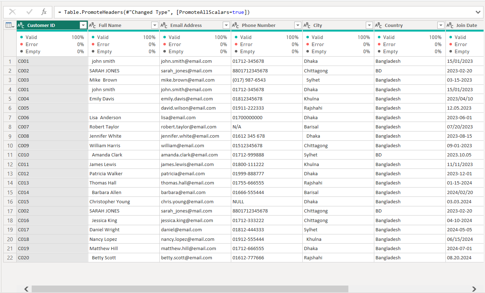
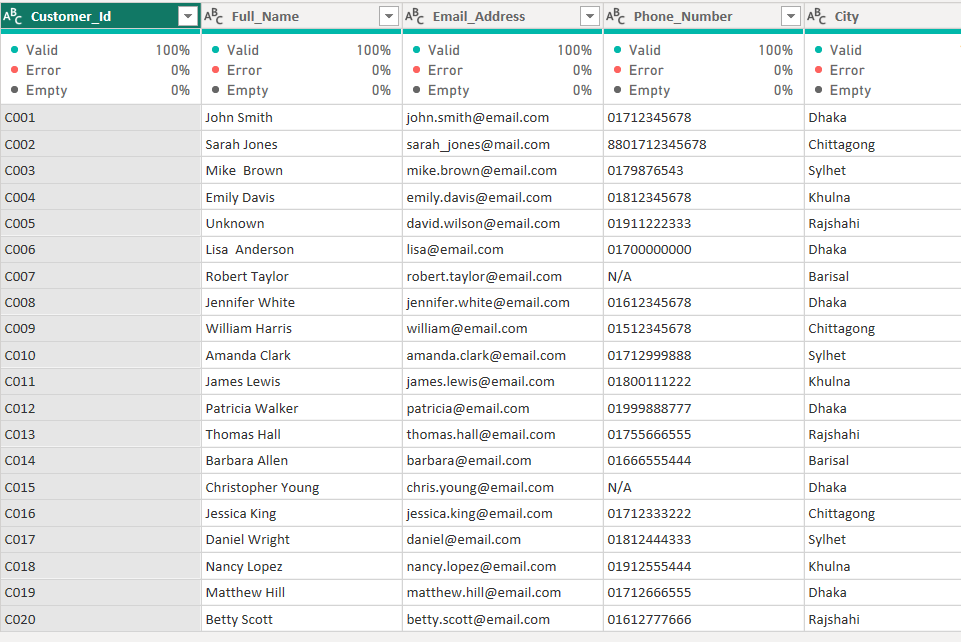
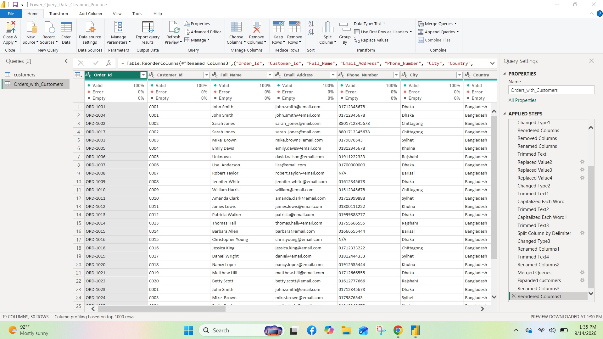

# Power Query Data Cleaning Practice

This project demonstrates how to clean messy real-world style sales and customer data using **Power Query in Power BI**.

The goal was to take raw, inconsistent data and transform it into a clean, analysis-ready table.

---

## Table of Contents

- [Project Overview](#project-overview)
- [Problems in the Raw Data](#problems-in-the-raw-data)
- [Tools Used](#tools-used)
- [Cleaning Steps](#cleaning-steps)
- [Folder Structure](#folder-structure)
- [Screenshots](#screenshots)
- [How to Use](#how-to-use)
- [What I Learned](#what-i-learned)
- [Author](#author)

---

## Project Overview

I worked with two messy datasets:

- **Customers** data
- **Orders** data

Both files contained common data quality issues that analysts face in real projects. I cleaned them step by step using Power Query and finally merged them into one clean table.

---

## Problems in the Raw Data

The original data had several issues:

- Mixed date formats (DD/MM/YYYY, MM/DD/YYYY, YYYY/MM/DD)
- Missing values (`null`, `N/A`, `NULL`, blank)
- Extra spaces and inconsistent text casing
- Duplicate rows
- Combined values in single columns (e.g. Quantity with "pcs", Category-SubCategory together)
- Inconsistent phone number formats
- Inconsistent status and customer type values

---

## Tools Used

- Power BI
- Power Query (Get Data → Transform Data)

---

## Cleaning Steps

### 1. Customers Table
- Removed duplicates
- Trimmed and cleaned text columns
- Split Full Name into First Name and Last Name
- Standardized Customer Type and Country
- Handled missing and invalid values
- Fixed data types

### 2. Orders Table
- Removed duplicates
- Fixed mixed date formats in Order Date
- Split Category-SubCategory into separate columns
- Extracted numeric Quantity (removed "pcs", "pc", etc.)
- Cleaned Unit Price (removed $ symbol)
- Standardized Order Status and Payment Method
- Handled missing Quantity and Amount values
- Set correct data types

### 3. Merge
- Merged **Orders** (Left) with **Customers** (Right)
- Used **Left Outer Join** on Customer ID
- Kept all orders and brought matching customer details

---

## Folder Structure

```
power-query-data-cleaning/
├── raw-data/
│   ├── customers.csv
│   └── orders.csv
├── screenshots/
│   ├── 01_raw_preview.png
│   ├── 02_after_cleaning.png
│   └── 03_final_merged_table.png
├── Power_Query_Data_Cleaning_Practice.pbix
└── README.md
```

---

## Screenshots

### Raw Data (Before Cleaning)


### After Cleaning


### Final Merged Table


---

## How to Use

1. Download the files from the `raw-data` folder
2. Open `Power_Query_Data_Cleaning_Practice.pbix` in Power BI
3. Go to **Transform Data** to see all Applied Steps
4. You can also load the raw CSV files yourself and practice the cleaning process

---

## What I Learned

- Handling mixed date formats in Power Query
- Cleaning inconsistent text and missing values
- Splitting and transforming columns
- Using Merge Queries (Left Outer Join)
- Building a clean, analysis-ready dataset from messy sources

---

## Author

**Rafat Khan**  
Aspiring Data Analyst
